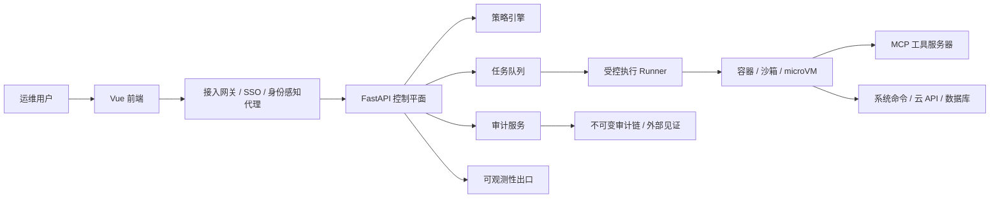

# 系统可扩展性与未来工作

> 本章定位：诚实区分「本系统已落地的能力」与「面向生产环境的演进规划」。前者是可演示、可验证的当前交付物；后者是在不改变核心设计哲学（用确定性约束概率式 LLM）的前提下，向企业级运维平台演进的工程路径。划清这条界线本身，也是软件工程中范围管理与质量保证的体现。

## 1. 当前系统的边界与定位

本系统当前定位为**单机、单租户、可演示的安全运维 Agent 原型**，部署于龙芯 LoongArch 架构 + 麒麟高级服务器版 V11 之上，已形成「FastAPI 控制面 + MCP 工具层 + 多防线安全护栏 + 可追溯审计链 + Vue3 前端」的完整可演示闭环。

在开发过程中，我们通过一轮外部代码审查，主动识别并诚实记录了一批「单机演示场景」与「生产部署场景」之间的范围取舍：例如管理接口的统一身份认证、密钥的动态管理与轮换、执行账户的操作系统级降权、审计的外部不可否认见证等。这些能力对一个孤立的演示环境并非必需，但对真实企业部署不可或缺。本章将它们系统化为一条清晰的演进路线，既说明当前边界的合理性，也展示项目的工程视野。

需要强调的是：本章描述的演进方向**多数尚未实现**，属于未来工作；凡当前已落地的能力，均会明确标注「已实现」，以避免与规划内容混淆。

## 2. 目标形态：控制平面与执行平面分离

当前原型由单一后端进程同时承担编排、鉴权、执行、审计与日志查询。面向生产，核心演进方向是将系统拆分为**控制平面**（回答「谁可以请求什么」）与**执行平面**（回答「即使被允许，最多能做什么」）两层，并让策略、审计、可观测性横切全链路。

这一形态的价值在于：访问控制与执行控制解耦后，任一层的漏洞都不会直接导致系统级后果——这正是本系统「护栏作为最后一道闸门」设计哲学在架构层面的自然延伸。MCP 协议适合作为执行平面的工具目录与能力发现层，但认证、沙箱与审计真相源不应由它承担。

## 3. 身份与授权

当前系统面向单机演示，未引入完整的身份体系。生产演进应建立两层授权：第一层在接入网关用 OIDC / OAuth2 授权码流程完成人员身份认证，短期可借反向代理或身份感知网关快速收敛后端暴露面，中长期再将 scopes 与重认证集成进应用内（FastAPI 原生支持 OAuth2 scopes，可与 OpenAPI、前端权限视图联动）；第二层在请求进入执行前，用策略即代码引擎（如 OPA）或关系型授权（如 OpenFGA）对「工具 × 资源 × 租户 × 环境」做细粒度、默认拒绝的判定。

这一方向与本系统**已实现**的「最小权限执行（非 root 启动闸门）」和「致命三要素 / Rule of Two 工具能力标签」一脉相承：后者已经在为每个工具标注能力维度，正是细粒度授权所需元数据的雏形。未来只需将运行时的布尔判定升级为可声明、可测试、可独立版本化的策略包。

## 4. 执行平面隔离

执行隔离是一条可分级落地的能力阶梯，强度与成本递增：

| 隔离层级 | 机制 | 隔离强度 | 适用场景 |
|---|---|---|---|
| 进程级沙箱 | namespaces / cgroups / rlimit / seccomp | 中 | 单机、读多写少（本系统已落地的起点）|
| 标准容器 | 容器 + cap-drop + 只读 rootfs + 资源限额 | 中 | 原型到中型项目 |
| 沙盒容器 | 在容器之上增强隔离 | 中到高 | 多租户、执行不可信工具 |
| microVM | 硬件虚拟化（如 Firecracker） | 高 | 企业级高风险写操作、跨租户 |

本系统**已实现**该阶梯的第一级——轻量进程级沙箱：护栏放行后的命令在受限资源配额（CPU、内存、进程数、输出大小、执行超时）下运行，必要时降权到非特权账户执行，失控或恶意命令即使被放行也无法拖垮宿主机。这既是「最小权限执行」原则的操作系统级落地，也直接缓解了 OWASP LLM Top 10 中的「过度代理（Excessive Agency）」风险。

未来演进方向是：将「读取系统状态」「修改系统状态」「跨环境运维」分到不同的 Runner 池与 sandbox profile，按风险域分级准入；对纯计算、纯解析、无系统副作用的插件，再补一层语言级执行面（如 WASI / Wasmtime），把这部分工具从「能触碰宿主机」的执行面彻底剥离。

## 5. 命令安全：从黑名单到结构化分析

本系统的命令护栏经历了从「关键字 / 正则黑名单」到「正则 + 路径规范化（realpath）+ Bash 抽象语法树（AST）结构分析」的演进（**已实现**）。AST 分析能识别重定向、管道、命令替换、子 shell、命令链等正则难以可靠覆盖的绕过结构，并与确定性规则做保守合并——AST 只能将风险判定升级，绝不放松规则已认定的高危命令。

面向生产，进一步的方向是「工具优先、命令兜底」：将高频运维动作尽量做成参数受 schema 约束的结构化 MCP 工具，把必须保留的自由 shell 能力收敛为命令模板、参数模式、AST 规则与箱外审批的组合，从源头持续压缩注入面与误操作面。

## 6. 不可否认审计与隐私

本系统**已实现**基于 HMAC 哈希链的可追溯审计：完整记录「接收指令 → 感知环境 → 推理决策 → 安全校验 → 执行结果」五段闭环，任一环节被事后篡改都会断链并被定位；并通过污点标记，记录每条执行路径是否摄入过不可信数据，从而能够证明「高危动作从未在污点状态下被放行」。

生产演进有三个方向。其一，将审计从「保存思维过程」升级为「保存决策证据」——长期保存的应是身份与租户、策略版本、工具版本、参数摘要、风险评分、执行前后状态、用户确认与豁免、结果摘要、签名与哈希等结构化证据，而非冗长的模型原文，既支撑取证回放，又避免审计系统本身成为隐私与攻击面。其二，引入外部不可变见证（如透明日志 Rekor、不可变账本 immudb），将审计摘要定期锚定到本系统之外，实现真正的「不可抵赖」。其三，对审计、回放与模型上下文统一做敏感信息脱敏（PII 识别与遮罩），默认展示脱敏值、仅高权限用户可查看原文揭示，并制定数据保留与删除周期。

## 7. 可观测性、策略治理与可信交付

可观测性方面，生产环境应在前端请求、控制面、策略决策、Runner、MCP 调用、审计写入各环节透传统一的 trace_id 与上下文，将日志、指标、链路（如基于 OpenTelemetry 与 Prometheus）统一归集，使排障、性能分析与审计共用同一套上下文。

策略治理方面，当前规则以代码与 YAML 维护并支持热加载（**已实现**热加载与前端编辑）；随着工具、租户、环境增长，应进一步将规则升级为可测试、可签名、可独立回滚的声明式策略包，使「策略修改」与「执行修改」彻底解耦，策略引擎仅返回 allow / deny / 附加义务 / 拒绝原因，执行器只消费结果。

可信交付方面，应将依赖锁定（如 uv lock）、软件物料清单（SBOM）生成、静态扫描（CodeQL）、产物来源证明（artifact attestation）纳入持续集成，并以可验证的镜像或签名包、而非 zip 包作为部署真相源。本系统在 MCP 工具加载时已实现对工具描述的投毒 / 影子模式扫描（**已实现**，借鉴 mcp-scan 思路），是供应链安全意识的体现，未来可纳入上述更完整的交付治理体系。

## 8. 能力扩展与用户体验

工具生态的可持续扩展，关键在于建立稳定的**工具注册契约**：每个工具声明输入 / 输出 schema、权限需求、风险等级、执行 profile、审计字段、是否可 dry-run、是否可回滚。配合 Python entry points 的安装时发现与 pluggy 的运行时 hook，新工具可独立发布而无需频繁改动核心系统。前端则应把「我具备哪些权限、能访问哪些环境、哪些操作需要二次确认」做成固定的权限视图，而非靠报错反推。

对运维 Agent 而言，优秀的用户体验不是「像聊天一样快」，而是「像控制台一样清楚」——看得见权限、看得见风险、看得见依据。本系统**已实现**的思维链回放界面（含规则与 AI 研判两栏对比、哈希链完整性校验、致命三要素风险面板）正是这一理念的体现，未来可沿能力发现与权限视图方向继续深化。

## 9. 多租户与高可用

面向企业多团队 / 多客户场景，系统需从单实例演进为多副本、可水平扩展的形态：控制面与 Worker 无状态化、多副本部署，数据库与消息层独立高可用，执行任务采用幂等 ID 与重试策略；多环境（开发 / 预发 / 生产）以 GitOps 方式声明式管理（如 Helm + Argo CD）。租户隔离应分级设计——基础场景可用「租户 ID + 行级安全 + 命名空间 + 配额」，严格合规场景则需评估专属 Runner 池、专属数据平面乃至专属集群，因为命名空间通常不足以构成强隔离边界。这一层属于长期目标，其基础设施成本与本系统当前的竞赛 / 教学定位不匹配，故不在近期范围内。

## 10. 智能化演进路线

参考业界对运维 Agent 能力的分级（手动 → 告警关联 → 时间线摘要 → 单次诊断 → 多步 Agent 调查 → 闭环调查并修复），本系统当前处于「多步调查」一级，其**已实现**的智能根因分析与安全护栏，正是迈向「闭环修复」的前提——因为只有先解决「敢不敢让 AI 动手」的安全问题，才谈得上自动修复。

后续智能化方向包括：将「分析建议」升级为默认 dry-run、经策略判定、高风险双人确认、执行后留回滚点的**自动化修复编排**；综合身份、环境、工具等级、参数敏感度与模型置信度的**动态风险评分与确认预算**；将历史审计 trace 回放到脱敏环境、对比策略变更前后效果的**演练沙盘**；以及统计实际被批准的动作组合、反向建议收缩权限的**权限学习器**。模型层面，可引入统一网关实现可插拔的模型路由与故障回退——敏感任务优先走本地 / 私有模型，高质量任务走外部模型；本系统**已实现**的 DeepSeek 云端与 Qwen3 本地双 provider 切换，正是这一能力的雏形。

## 11. 分阶段演进路线图

下表将上述方向按优先级与依赖关系归为三个阶段。需再次说明：本路线图以本项目竞赛 / 教学交付完成之后为起点，描述的是产品化演进的设想，而非已实施计划。其排序原则是：先做能立刻缩小攻击面与误操作面的能力，再做扩展性，最后做多租户与高度智能化。

| 阶段 | 重点能力 | 说明 |
|---|---|---|
| 近期 | 统一认证入口、动态密钥、可观测性全链路 trace、依赖锁定与 SBOM | 从「演示安全」迈向「部署更安全」，多为低成本高收益的工程化加固 |
| 中期 | 策略即代码（OPA/OpenFGA）、控制面/执行面拆分与任务队列、多环境 GitOps、审计外部见证、对抗评测流水线 | 形成可复用的平台底座，规则与执行解耦、交付可审计 |
| 长期 | 多租户隔离与租户级策略、高风险 microVM Runner、自动修复编排与回滚、可插拔模型池、演练沙盘与权限学习器 | 具备企业级治理与高度智能化能力 |

## 12. 小结

本系统在单机环境内，已将「用确定性安全约束不可控的 LLM」这一核心命题落地为一套可演示、可验证、可量化的安全运维 Agent：多防线护栏、AST 命令分析、轻量执行沙箱、哈希链审计与污点追踪、致命三要素面板，并通过加护栏 / 不加护栏的对比实验给出了量化证据。本章描绘的演进路线表明，这一核心设计哲学具备向控制面 / 执行面分离、策略即代码、不可否认审计、多租户隔离与闭环自动修复持续生长的空间——其真正的护城河，始终是策略治理、审计完整性、前端可解释性与安全约束能力，而非工具数量的堆叠。
